# Splash

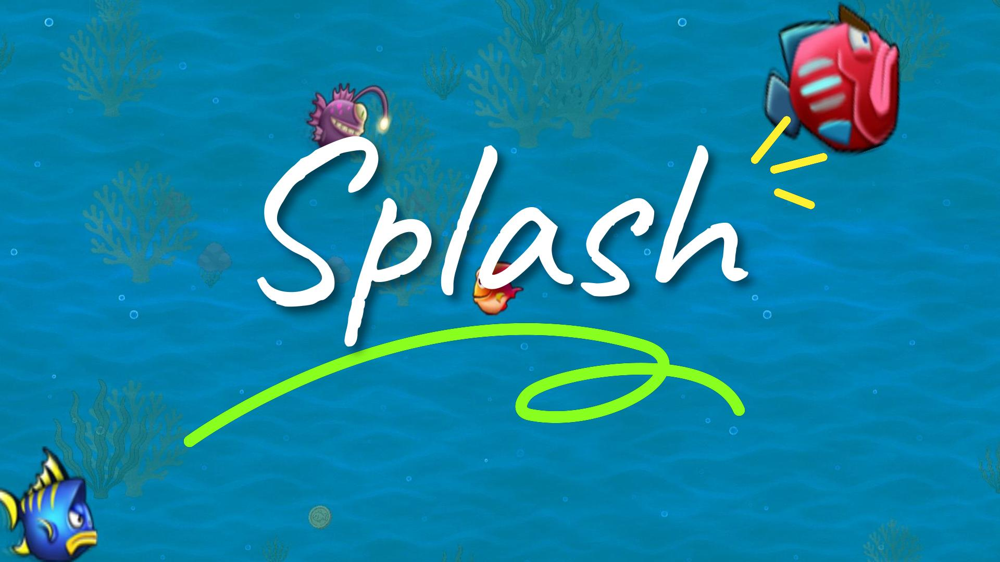

## Content
- [Project Overview](#project-overview)
- [Key Features](#key-features)
- [Screenshots](#screenshots)
- [Installation](#installation)
- [Game Architecture](#game-architecture)
- [Class Diagrams](#class-diagrams)
- [Game Systems](#game-systems)
- [Future Enhancements](#future-enhancements)
- [License](#license)
- [Change Log](CHANGELOG.md)

## Overview
Splash is a JavaFX-based Feeding Frenzy-style game where players control a fish navigating an underwater environment. The game features size-based progression mechanics, intelligent NPC behavior, parallax scrolling, and multilingual support. Developed as part of the Comprehensive Java Practice course at Zhejiang Normal University.

## Key Features
- **Size-based progression system** - Grow by consuming smaller fish
- **Hierarchical AI** - Three intelligence levels for NPC fish (basic, intermediate, advanced)
- **Parallax rendering** - Depth-based visual effects for underwater immersion
- **Optimized collision detection** - Circular hitboxes with size-based resolution
- **Multi-language support** - English, Arabic, and Chinese localization
- **Data persistence** - Save/load player profiles and configuration
- **Screen management system** - Smooth transitions between game states
- **Configurable settings** - Adjust difficulty, rendering, and gameplay parameters

## Screenshots
| Welcome Screen | Main Menu | Gameplay |
|----------------|-----------|----------|
| 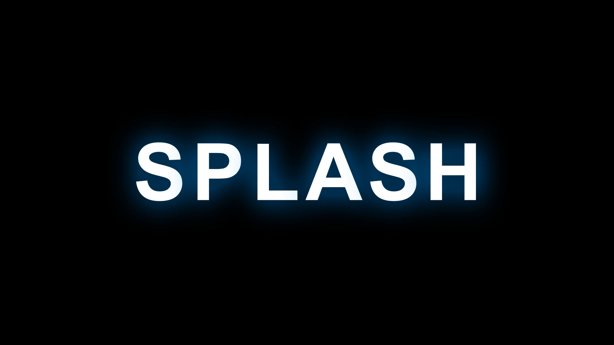 | 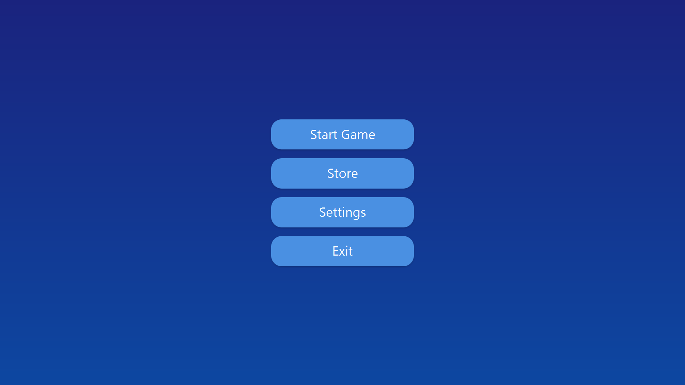 | 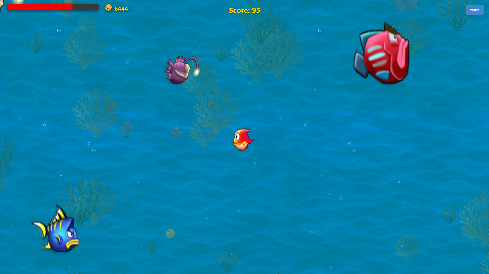 |

| Store | Settings | Game Over |
|-------|----------|-----------|
| 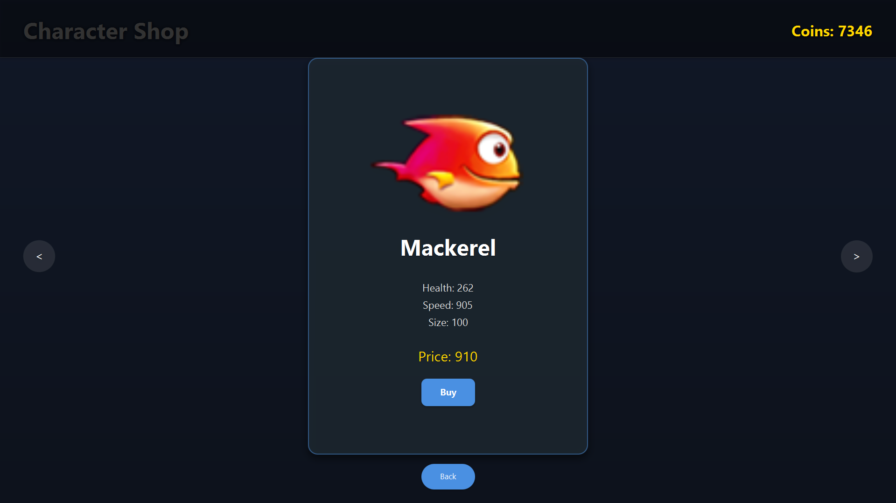 | 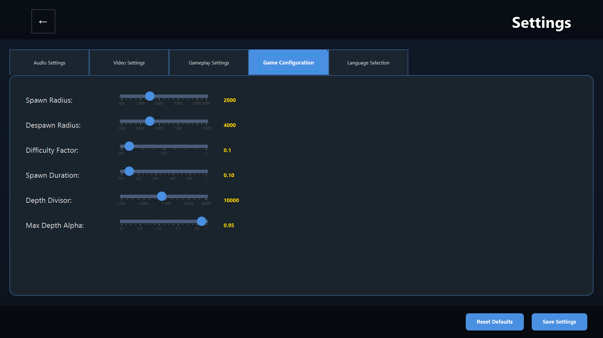 | 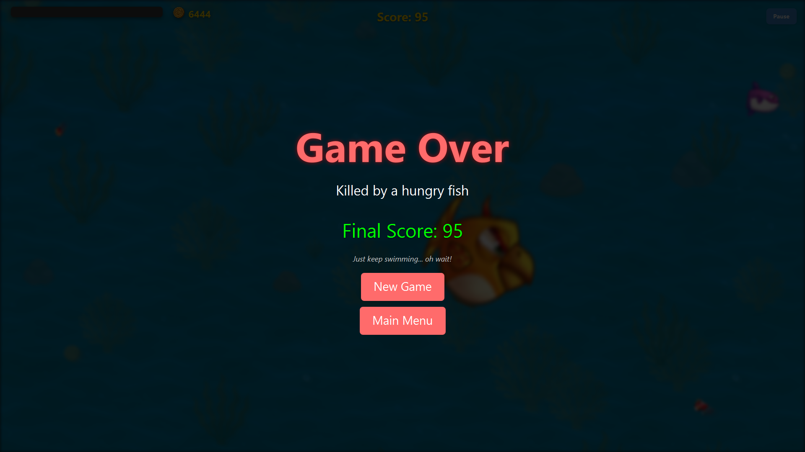 |

## Installation
### Prerequisites
- Java 21 JDK
- Maven 3.6+

### Build & Run
```bash
# Clone repository
git clone https://github.com/Al-rimi/splash.git

# Build project
mvn clean package

# Run game
java -jar target/splash-1.0.0.0.jar
```

### Windows Installer
Download the pre-built installer for Windows:  
[`Splash_1.0.0.0.exe`](https://github.com/Al-rimi/splash/releases)

## Game Architecture
Splash follows a modular, component-based architecture with clear separation of concerns:

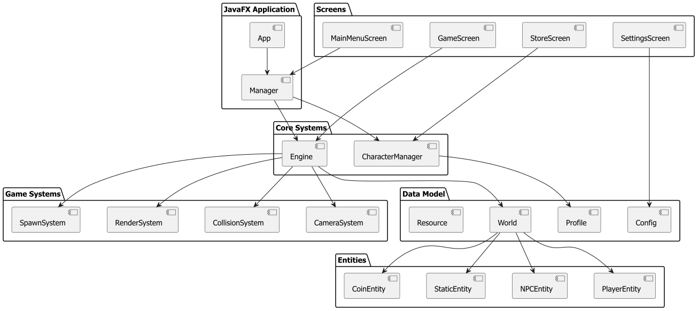

### Layers:
1. **Presentation Layer**: JavaFX UI components and rendering
2. **Application Layer**: Screen management and transitions
3. **Domain Layer**: Core game logic and entities
4. **Data Layer**: Persistent storage and resource management

## Class Diagrams
### Entity Hierarchy
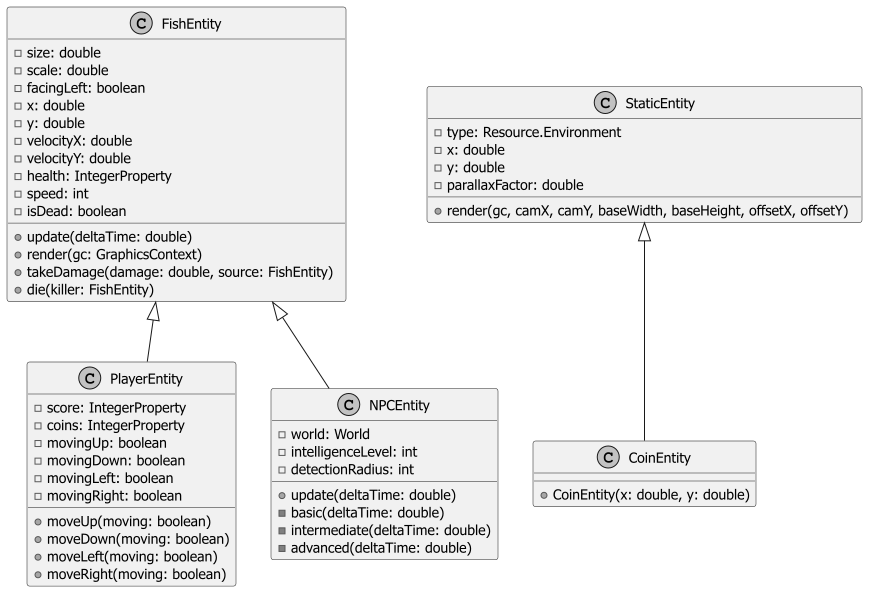

### Game Systems
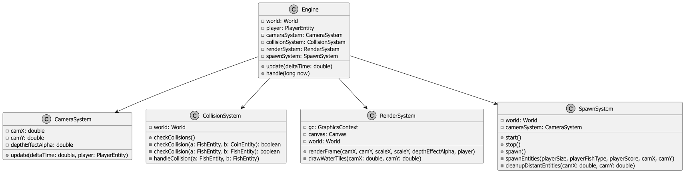

### Screen Management
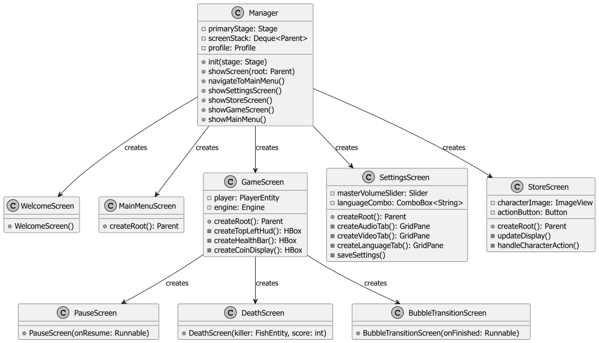

## Game Systems
### Collision Handling
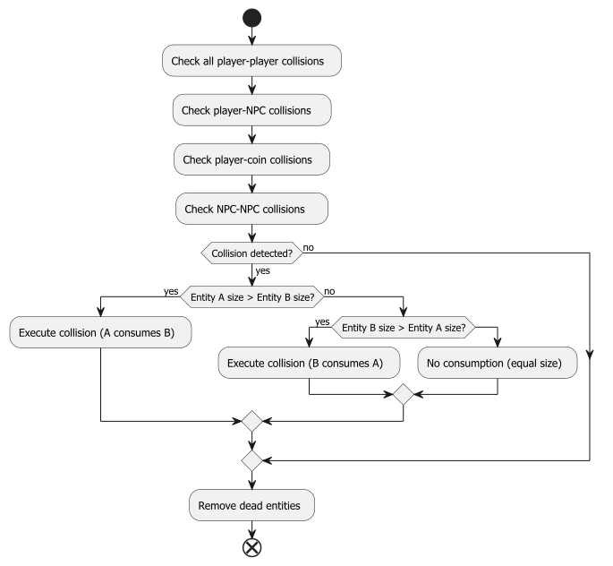

### Game Loop
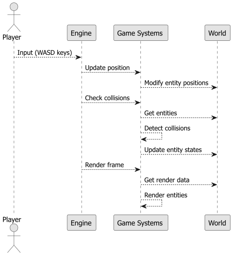

### Data Persistence
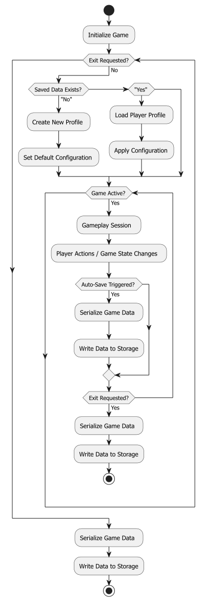

## Key Implementation
```java
// NPC Advanced AI Behavior
private void advanced(double deltaTime) {
    FishEntity player = findNearestPlayer();
    FishEntity nearestEnemy = findNearestEntity(true);
    
    if (player != null && player.size < size) 
        pursue(player.getX(), player.getY(), speed*1.2, 0.1);
    else if (player != null) 
        fleeFrom(player.getX(), player.getY(), speed*1.2, 0.1);
    
    if (nearestEnemy != null) 
        fleeFrom(nearestEnemy.getX(), nearestEnemy.getY(), speed*1.2, 0.1);
    else 
        wander(deltaTime, directionChangeInterval*0.5, speed, 0.05);
}
```

## Future Enhancements
- **Multiplayer support** - Online leaderboards and PvP modes
- **Flocking behaviors** - Realistic fish school simulations
- **New environments** - Arctic waters, coral reefs, deep-sea trenches
- **Power-up system** - Temporary abilities and boosts
- **Ecosystem simulation** - Complex food chain dynamics
- **Environment-aware navigation** - AI that navigates around obstacles

## License
This project is licensed under the [MIT License](LICENSE). See the LICENSE file for details.